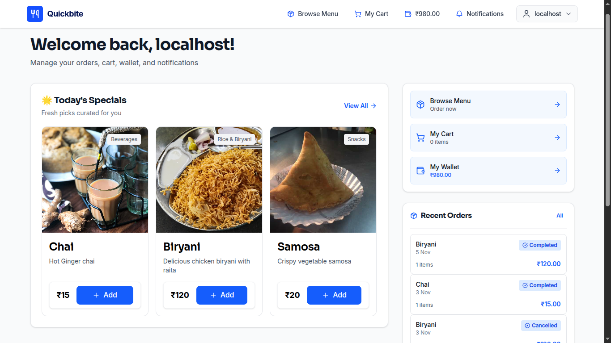
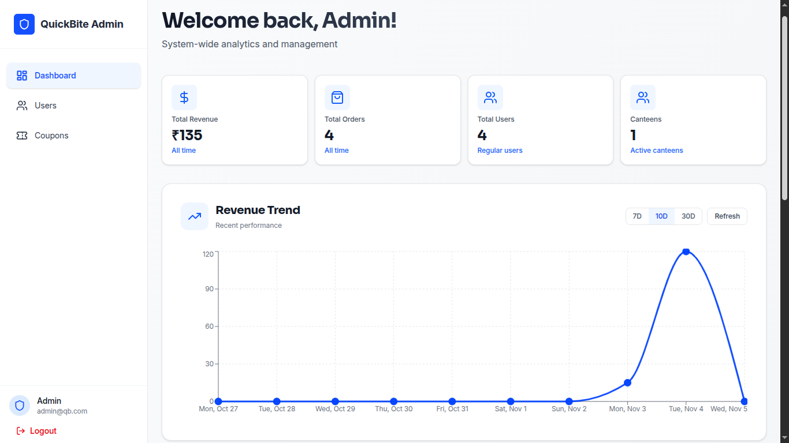
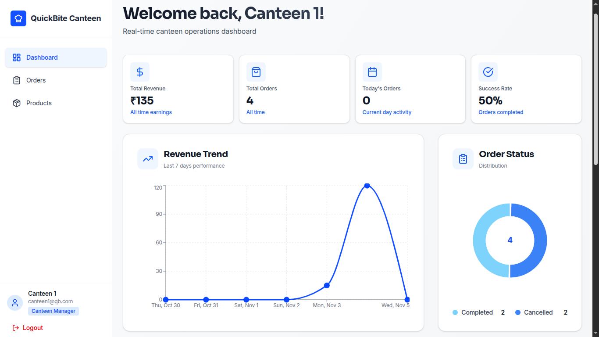

# 🍽️ QuickBite

A full-stack food ordering & canteen management platform built with **Next.js** | **TypeScript** | **Supabase** | **Razorpay**

---

##  Screenshots


| User Panel| Admin Panel| Canteen Panel |
|-----------|------|------------|
|  |  |  |

---

##  Quick Start

### Installation
```bash
git clone https://github.com/localhost969/QuickBite.git
cd QuickBite
npm install
```

### Environment Setup

**Required Variables:**
```env
NEXT_PUBLIC_SUPABASE_URL=your_supabase_url
NEXT_PUBLIC_SUPABASE_ANON_KEY=your_anon_key
RAZORPAY_KEY_ID=your_razorpay_key
RAZORPAY_KEY_SECRET=your_razorpay_secret
```

### Run
```bash
npm run dev
```

Visit `http://localhost:3000`

---

##  Project Structure

```
QuickBite/
├── components/
│   ├── admin/
│   ├── canteen/
│   └── user/
├── pages/
│   ├── admin/
│   ├── api/
│   ├── canteen/
│   └── user/
├── lib/
├── context/
├── database/
├── public/
├── styles/
├── types/
└── ...                  # Config files (package.json, tsconfig.json, etc.)
```

---

